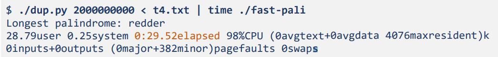
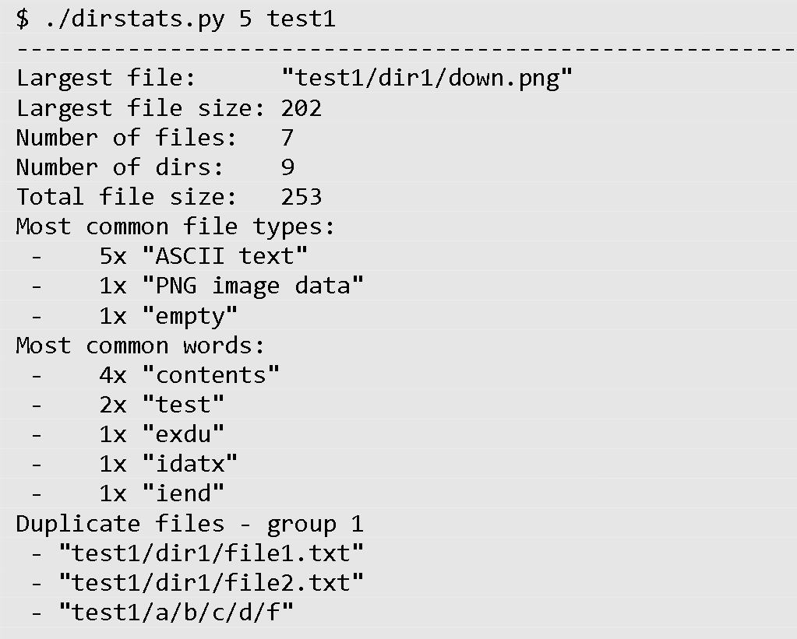
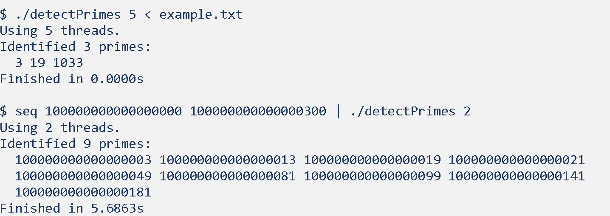
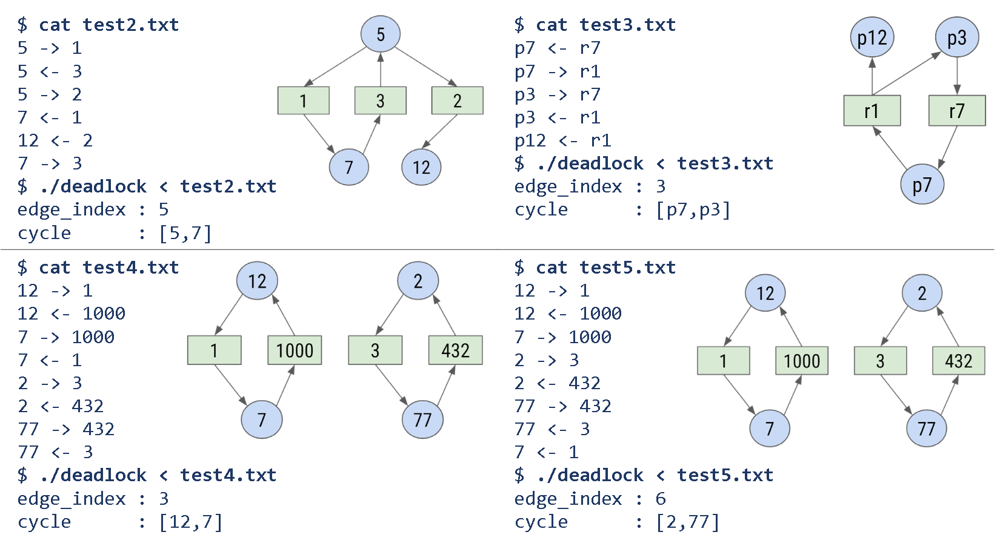
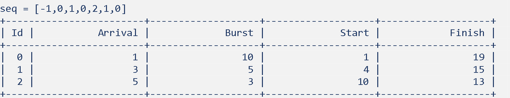
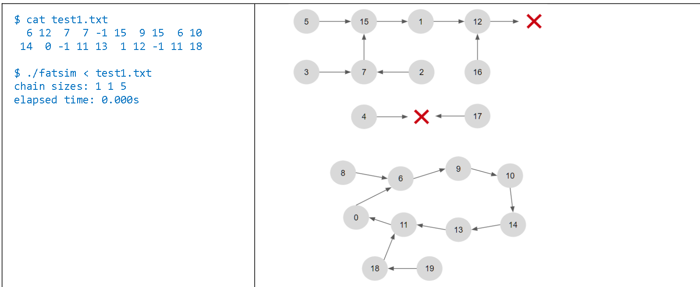
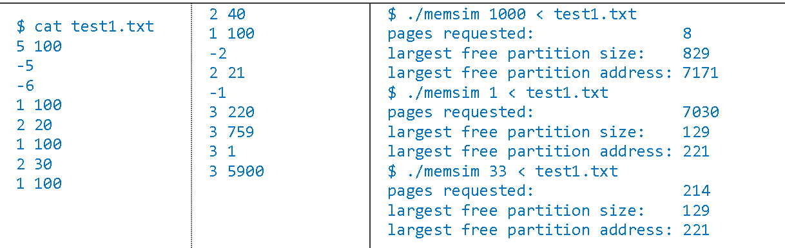

# Operating System Operations Simulations

## Palindrome

Read through a file and find the longest palindrome. Needs to be as efficent as possible, as file sizes reach 2Gb+ and needs to finish under 30secs.

|                                                                                                              | 
|   :--:                                                                                                                                                | 
|   Figure 1: Sample of program running|

## analyzeDir

Get the largest file path, largest file size, number of files, number of dirs, common file types, common words and total files size given a parent directory. Needs to be efficent, as file and sub directories reach 10000+ total.

|                                                                                                              | 
|   :--:                                                                                                                                                | 
|   Figure 2: Sample of program running|
## pi-calc
Use threads to estimate the total area of a circle using squares of size radius/threads.

## detect-primes
Detect primes in a given file or in range(2, 2^63-2) by using threads, parrellization, cancellation and synchronization 

|                                                                                                              | 
|   :--:                                                                                                                                                | 
|   Figure 3: Sample of program running|

## deadlock
Detect a deadlock in a simulated system with graphs 

|                                                                                                              | 
|   :--:                                                                                                                                                | 
|   Figure 4: Sample of program running|

## rrsched
Round robin CPU scheduleing simulator for a given list of proccesses and time slices

|                                                                                                              | 
|   :--:                                                                                                                                                | 
|   Figure 5: Sample of program running|

## fatsim
Find the longest possible chain that terminates on -1 in the given fat chain

|                                                                                                              | 
|   :--:                                                                                                                                                | 
|   Figure 6: Sample of program running|

## memsim 
Worst-fit dynamic partition simulator 

|                                                                                                              | 
|   :--:                                                                                                                                                | 
|   Figure 7: Sample of program running|
